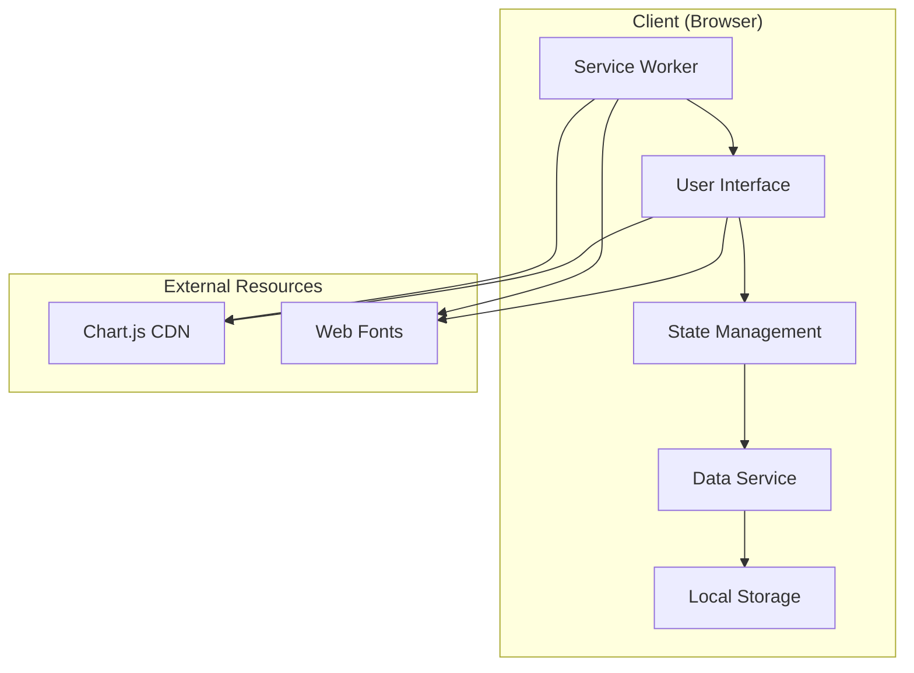

# Design Document: 허리건강 관리 웹앱

## Overview

허리건강 관리 웹앱은 Progressive Web App(PWA) 아키텍처를 기반으로 한 클라이언트 사이드 애플리케이션입니다. 사용자가 허리 상태를 기록하고, 맞춤형 운동을 추천받으며, 진행상황을 시각적으로 추적할 수 있는 종합적인 건강 관리 도구를 제공합니다.

핵심 설계 원칙:
- **오프라인 우선**: 서비스 워커를 통한 완전한 오프라인 기능
- **반응형 디자인**: 모든 기기에서 최적화된 사용자 경험
- **데이터 프라이버시**: 모든 데이터는 로컬에 저장되어 사용자 프라이버시 보장
- **점진적 향상**: 기본 기능부터 고급 기능까지 단계적 제공

## Architecture

### 전체 아키텍처



### App Shell Architecture

PWA의 App Shell 패턴을 적용하여 핵심 UI 구조와 콘텐츠를 분리:

- **Shell**: 네비게이션, 헤더, 기본 레이아웃 (캐시됨)
- **Content**: 동적 데이터와 차트 (런타임 생성)

## Components and Interfaces

### 1. Core Components

#### HealthRecordManager
허리 상태 기록을 관리하는 핵심 컴포넌트

```typescript
interface HealthRecord {
  id: string;
  date: Date;
  painLevel: number; // 1-10 scale
  painLocation: PainLocation[];
  notes?: string;
  timestamp: number;
}

interface PainLocation {
  area: 'upper' | 'middle' | 'lower';
  side: 'left' | 'right' | 'center';
  intensity: number; // 1-10 scale
}

class HealthRecordManager {
  addRecord(record: Omit<HealthRecord, 'id' | 'timestamp'>): Promise<HealthRecord>
  getRecords(dateRange?: DateRange): Promise<HealthRecord[]>
  updateRecord(id: string, updates: Partial<HealthRecord>): Promise<HealthRecord>
  deleteRecord(id: string): Promise<void>
}
```

#### ExerciseRecommendationEngine
통증 수준에 따른 운동 추천 엔진

```typescript
interface Exercise {
  id: string;
  name: string;
  description: string;
  duration: number; // seconds
  difficulty: 'low' | 'medium' | 'high';
  targetPainLevel: number[]; // applicable pain levels
  instructions: string[];
  videoUrl?: string;
}

interface ExerciseSession {
  id: string;
  exercises: Exercise[];
  totalDuration: number;
  completedAt?: Date;
  painLevelBefore?: number;
  painLevelAfter?: number;
}

class ExerciseRecommendationEngine {
  getRecommendations(painLevel: number, history?: HealthRecord[]): Exercise[]
  createSession(exercises: Exercise[]): ExerciseSession
  completeSession(sessionId: string, feedback: SessionFeedback): Promise<void>
}
```

#### ProgressTracker
진행상황 추적 및 분석 컴포넌트

```typescript
interface ProgressMetrics {
  averagePainLevel: number;
  painTrend: 'improving' | 'stable' | 'worsening';
  exerciseCompliance: number; // percentage
  streakDays: number;
  totalExerciseSessions: number;
}

class ProgressTracker {
  calculateMetrics(records: HealthRecord[], sessions: ExerciseSession[]): ProgressMetrics
  generateChartData(records: HealthRecord[], period: TimePeriod): ChartData
  getInsights(metrics: ProgressMetrics): string[]
}
```

#### ExerciseTimer
운동 실행 및 타이머 관리

```typescript
interface TimerState {
  currentExercise: Exercise | null;
  remainingTime: number;
  isRunning: boolean;
  isPaused: boolean;
  sessionProgress: number; // 0-100
}

class ExerciseTimer {
  startSession(session: ExerciseSession): void
  pauseTimer(): void
  resumeTimer(): void
  skipExercise(): void
  completeSession(): void
  onTimerUpdate(callback: (state: TimerState) => void): void
}
```

### 2. Data Layer Components

#### LocalStorageService
로컬 스토리지 관리 서비스

```typescript
interface StorageService {
  save<T>(key: string, data: T): Promise<void>
  load<T>(key: string): Promise<T | null>
  remove(key: string): Promise<void>
  clear(): Promise<void>
  backup(): Promise<string> // JSON export
  restore(backupData: string): Promise<void>
}

class LocalStorageService implements StorageService {
  private readonly STORAGE_PREFIX = 'back-health-'
  private readonly ENCRYPTION_KEY = 'user-generated-key'
  
  // JSON 직렬화/역직렬화 with validation
  // 데이터 무결성 검증
  // 자동 백업 기능
}
```

### 3. UI Components

#### ChartRenderer
Chart.js를 활용한 데이터 시각화

```typescript
interface ChartConfig {
  type: 'line' | 'bar' | 'radar';
  data: ChartData;
  options: ChartOptions;
}

class ChartRenderer {
  renderPainTrendChart(records: HealthRecord[]): HTMLCanvasElement
  renderExerciseProgressChart(sessions: ExerciseSession[]): HTMLCanvasElement
  renderPainLocationHeatmap(records: HealthRecord[]): HTMLCanvasElement
  updateChart(chartId: string, newData: ChartData): void
}
```

#### ResponsiveUI
반응형 사용자 인터페이스 관리

```typescript
interface ViewportConfig {
  mobile: { maxWidth: 768 }
  tablet: { minWidth: 769, maxWidth: 1024 }
  desktop: { minWidth: 1025 }
}

class ResponsiveUI {
  detectViewport(): keyof ViewportConfig
  adaptLayout(viewport: keyof ViewportConfig): void
  optimizeChartSize(viewport: keyof ViewportConfig): ChartOptions
}
```

## Data Models

### 핵심 데이터 구조

```typescript
// 사용자 프로필
interface UserProfile {
  id: string;
  createdAt: Date;
  preferences: {
    reminderTime?: string; // HH:MM format
    exerciseDifficulty: 'beginner' | 'intermediate' | 'advanced';
    painScale: 'numeric' | 'visual';
  };
  medicalHistory?: {
    conditions: string[];
    medications: string[];
    physicalLimitations: string[];
  };
}

// 앱 상태
interface AppState {
  currentView: 'dashboard' | 'record' | 'exercise' | 'progress';
  isOnline: boolean;
  lastSync: Date;
  activeSession?: ExerciseSession;
  notifications: Notification[];
}

// 설정
interface AppSettings {
  theme: 'light' | 'dark' | 'auto';
  language: 'ko' | 'en';
  dataRetentionDays: number;
  autoBackup: boolean;
  offlineMode: boolean;
}
```

### 데이터 검증 스키마

```typescript
const HealthRecordSchema = {
  painLevel: { type: 'number', min: 1, max: 10, required: true },
  painLocation: { type: 'array', minItems: 1, required: true },
  date: { type: 'date', required: true },
  notes: { type: 'string', maxLength: 500, required: false }
};

const ExerciseSchema = {
  name: { type: 'string', minLength: 1, maxLength: 100, required: true },
  duration: { type: 'number', min: 10, max: 3600, required: true },
  difficulty: { type: 'enum', values: ['low', 'medium', 'high'], required: true }
};
```

## Correctness Properties

*A property is a characteristic or behavior that should hold true across all valid executions of a system-essentially, a formal statement about what the system should do. Properties serve as the bridge between human-readable specifications and machine-verifiable correctness guarantees.*

### Property-Based Testing Properties

다음 속성들은 사전 작업 분석을 바탕으로 수용 기준에서 도출되었습니다:

**Property 1: 통증 기록 저장 일관성**
*For any* 유효한 통증 수준(1-10)과 통증 위치 조합에 대해, 저장 후 검색했을 때 동일한 값이 반환되어야 한다
**Validates: Requirements 1.1, 1.2**

**Property 2: 건강 기록 타임스탬프 포함**
*For any* 건강 기록에 대해, 저장된 기록은 반드시 유효한 타임스탬프를 포함해야 한다
**Validates: Requirements 1.3**

**Property 3: 잘못된 입력 거부**
*For any* 잘못된 통증 기록 입력(빈 값, null, 범위 외 값)에 대해, 시스템은 입력을 거부하고 현재 상태를 유지해야 한다
**Validates: Requirements 1.4**

**Property 4: 통증 수준별 운동 추천**
*For any* 통증 수준에 대해, 추천된 운동의 난이도는 통증 수준과 반비례해야 한다 (높은 통증 = 저강도, 낮은 통증 = 고강도)
**Validates: Requirements 2.1, 2.2, 2.3**

**Property 5: 운동 추천 필수 정보 포함**
*For any* 운동 추천에 대해, 모든 운동은 설명, 소요시간, 난이도 정보를 포함해야 한다
**Validates: Requirements 2.4**

**Property 6: 운동 완료 기록 저장**
*For any* 완료된 운동 세션에 대해, 완료 기록이 저장되고 진행률이 올바르게 업데이트되어야 한다
**Validates: Requirements 3.2**

**Property 7: 운동 타이머 시작**
*For any* 운동 시작 요청에 대해, 타이머가 올바른 초기 상태로 시작되어야 한다
**Validates: Requirements 4.1**

**Property 8: 타이머 완료 후 전환**
*For any* 타이머 완료 이벤트에 대해, 다음 운동으로 전환되거나 세션 완료가 처리되어야 한다
**Validates: Requirements 4.2**

**Property 9: 운동 일시정지 상태 저장**
*For any* 운동 일시정지 요청에 대해, 현재 진행상황이 정확히 저장되어야 한다
**Validates: Requirements 4.3**

**Property 10: 운동 세션 완료 기록**
*For any* 완료된 운동 세션에 대해, 완료 시간과 수행한 운동 목록이 기록되어야 한다
**Validates: Requirements 4.4**

**Property 11: 데이터 즉시 저장**
*For any* 사용자 데이터 입력에 대해, 로컬 스토리지에 즉시 저장되어야 한다
**Validates: Requirements 5.1**

**Property 12: 데이터 직렬화 라운드트립**
*For any* 유효한 시스템 객체에 대해, JSON으로 직렬화한 후 역직렬화하면 동일한 객체가 생성되어야 한다
**Validates: Requirements 5.2**

**Property 13: 앱 재시작 후 데이터 로드**
*For any* 저장된 데이터에 대해, 앱 재시작 후 동일한 데이터가 로드되어야 한다
**Validates: Requirements 5.3**

**Property 14: 손상된 데이터 복구**
*For any* 손상된 데이터에 대해, 시스템은 오류를 기록하고 기본값으로 복구해야 한다
**Validates: Requirements 5.4**

**Property 15: 폼 입력 검증 피드백**
*For any* 폼 입력에 대해, 실시간 검증과 적절한 피드백이 제공되어야 한다
**Validates: Requirements 6.2**

**Property 16: 잘못된 입력 오류 메시지**
*For any* 잘못된 입력에 대해, 명확하고 유용한 오류 메시지가 생성되어야 한다
**Validates: Requirements 6.4**

## Error Handling

### 오류 분류 및 처리 전략

#### 1. 사용자 입력 오류
- **검증 실패**: 실시간 피드백으로 사용자 안내
- **범위 초과**: 허용 범위 표시 및 자동 보정 제안
- **필수 필드 누락**: 시각적 강조 및 명확한 메시지

#### 2. 데이터 저장 오류
- **스토리지 용량 부족**: 오래된 데이터 정리 제안
- **데이터 손상**: 자동 백업에서 복구 시도
- **직렬화 실패**: 기본값으로 대체 및 사용자 알림

#### 3. 시스템 오류
- **네트워크 연결 실패**: 오프라인 모드 자동 전환
- **브라우저 호환성**: 기능 저하 모드 제공
- **메모리 부족**: 불필요한 데이터 정리

### 오류 복구 메커니즘

```typescript
interface ErrorRecoveryStrategy {
  canRecover(error: AppError): boolean;
  recover(error: AppError): Promise<RecoveryResult>;
  fallback(error: AppError): void;
}

class DataCorruptionRecovery implements ErrorRecoveryStrategy {
  async recover(error: DataCorruptionError): Promise<RecoveryResult> {
    // 1. 백업에서 복구 시도
    // 2. 부분 데이터 복구
    // 3. 기본값으로 초기화
  }
}
```

## Testing Strategy

### 이중 테스팅 접근법

이 시스템은 **단위 테스트**와 **속성 기반 테스트**를 모두 활용하여 포괄적인 테스트 커버리지를 제공합니다:

#### 단위 테스트 (Unit Tests)
- **특정 예제**: 알려진 입력에 대한 예상 출력 검증
- **엣지 케이스**: 경계값, 빈 입력, 극한 상황 테스트
- **통합 지점**: 컴포넌트 간 상호작용 검증
- **오류 조건**: 예외 상황 및 오류 처리 검증

#### 속성 기반 테스트 (Property-Based Tests)
- **범용 속성**: 모든 입력에 대해 성립해야 하는 규칙 검증
- **랜덤 입력**: 다양한 입력 조합으로 포괄적 테스트
- **최소 100회 반복**: 각 속성 테스트는 최소 100번 실행
- **반례 축소**: 실패 시 최소 반례 자동 생성

### 속성 기반 테스트 설정

**테스팅 라이브러리**: [fast-check](https://github.com/dubzzz/fast-check) (JavaScript/TypeScript용)

**테스트 설정**:
```typescript
// 각 속성 테스트는 최소 100회 반복
const testConfig = { numRuns: 100 };

// 태그 형식: Feature: back-health-management, Property N: [속성 제목]
describe('Feature: back-health-management, Property 1: 통증 기록 저장 일관성', () => {
  it('should maintain consistency when storing and retrieving pain records', () => {
    fc.assert(fc.property(
      painLevelArbitrary, // 1-10 범위
      painLocationArbitrary, // 유효한 통증 위치 조합
      (painLevel, painLocation) => {
        // 속성 검증 로직
      }
    ), testConfig);
  });
});
```

### 테스트 데이터 생성기

```typescript
// 스마트 생성기 - 입력 공간을 지능적으로 제한
const painLevelArbitrary = fc.integer({ min: 1, max: 10 });

const painLocationArbitrary = fc.array(
  fc.record({
    area: fc.constantFrom('upper', 'middle', 'lower'),
    side: fc.constantFrom('left', 'right', 'center'),
    intensity: fc.integer({ min: 1, max: 10 })
  }),
  { minLength: 1, maxLength: 3 }
);

const exerciseArbitrary = fc.record({
  name: fc.string({ minLength: 1, maxLength: 100 }),
  duration: fc.integer({ min: 10, max: 3600 }),
  difficulty: fc.constantFrom('low', 'medium', 'high')
});
```

### 테스트 실행 전략

1. **개발 중**: 각 기능 구현 후 관련 속성 테스트 실행
2. **통합 테스트**: 전체 속성 테스트 스위트 실행
3. **회귀 테스트**: 코드 변경 시 영향받는 속성들 재검증
4. **성능 테스트**: 대용량 데이터로 속성 검증

### 테스트 실패 처리

속성 테스트 실패 시 다음 단계를 따릅니다:

1. **반례 분석**: fast-check가 제공하는 최소 반례 검토
2. **버그 분류**: 코드 버그 vs 테스트 오류 vs 명세 문제
3. **수정 적용**: 근본 원인에 따른 적절한 수정
4. **회귀 방지**: 반례를 단위 테스트로 추가

이러한 이중 테스팅 접근법을 통해 구체적인 버그 발견(단위 테스트)과 일반적인 정확성 보장(속성 테스트)을 모두 달성할 수 있습니다.